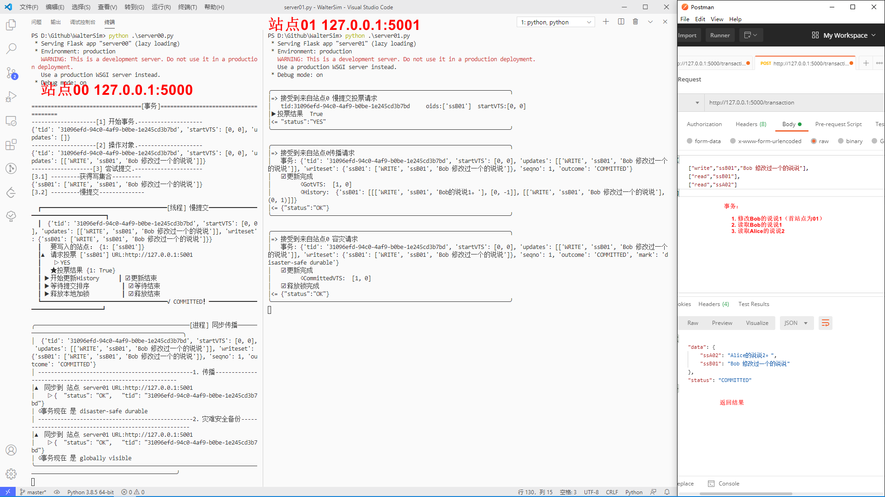
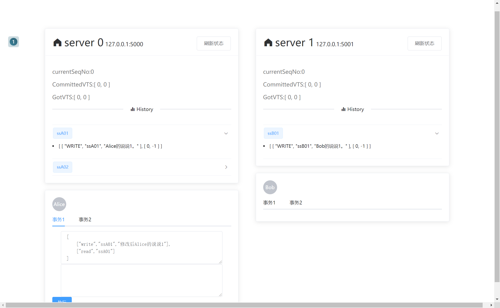

### WalterSim

> 使用Flask和Vue模拟出Walter系统的情况
>
> 论文 《Transactional storage for geo-replicated systems》

#### 后端演示图片

#### 前端演示图片


#### 运行:rocket:
##### 1. 启动后端
```cmd
cd .\backEnd\
python server00.py
python server01.py
```
##### 2. 启动前端
浏览器中打开


#### 模拟说明 :partly_sunny:
- 分别模拟了两个站点 
    - site00 
    - site01
- 三个用户及首选站点
    - Alice  site00  ssA01 (regular object)
    - Bob   site01  ssB01 (regular object)
    - Eva    site01  flEva    (cset)
- 四个预置事务
    - Alice发表说说
        1. Alice写数据到ssA01
        2. Alice读取ssA01
    - Bob发表说说并评论Alice
        1. Bob写数据到ssB01
        2. Bob重写ssA01
        3. Bob读取ssA01
    - Alice添加Eva好友 （可指定延时与下面冲突）
        1. Alice写flEva
        2. 读取flEva
    - Bob添加Eva好友 （可指定延时）
        1. Bob写flEva
        2. 读取flEva
    